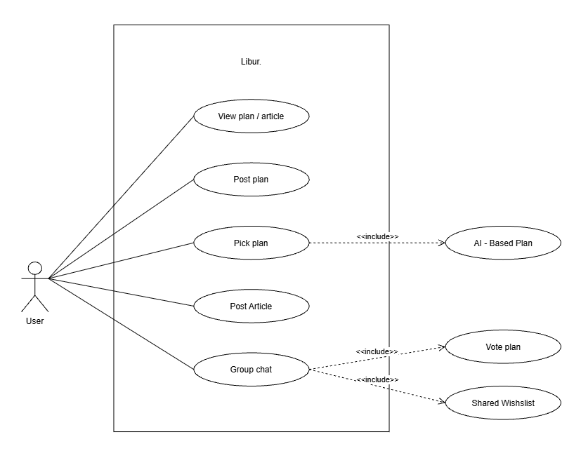

# Libur

**Libur** ("holiday" / "day off" in Malay & Indonesian) is a collaborative trip-planning app that combines AI-generated plans   , community-shared travel plans and articles, and group decision-making where everybody wants (group chat + in-app voting) so that planning a trip with friends stops being a scattered mess of screenshots and group-chat chaos.

---

## Ideation

### Problem & Idea Origin

Group trips constantly fall apart at the planning stage because plans, idea  end up scattered across half a dozen different apps. Furthermore, as our own real-life experiences prove, many of us are simply too lazy to take on the tedious burden of building a structured schedule from scratch. To solve this, Libur blends AI-generated plans, community-shared plans, travel articles (Inspired by Substack), group-chat and voting into one seamless platform, letting you experience a perfectly curated trip without the mental heavy lifting.

- **AI-Based Plan** — AI suggestions (place, accommodation, transport).
- **Article + Plan duality** — users can post either inspirational travel articles *or* structured plans, and view/browse both through the same "View plan/article" entry point, blending inspiration and execution in one feed.
- **Voting** — ensuring every voice is heard and keeping the group happy with transparent, democratic decision-making built right into the discussion.

### Visual Diagrams & Mindmaps
The core feature set was mapped as a UML **use-case diagram**, evolved across two passes:

**Latest use-case diagram**

### Iteration & Idea Evolution
Libur went through a documented pivot between its hand-drawn draft and the final digital use-case diagram:

**Early hand-drawn draft**

| Draft | Final | What changed & why |
|---|---|---|
| *Vote plan* listed as its own standalone use case | *Vote plan* included into **Group chat**  | Voting only makes sense in the context of a group discussion, so it was merged into the chat flow instead of being a separate, disconnected action. |
| *AI-Based Plan* listed as its own standalone use case | *AI-Based Plan* included into **Pick plan** | The team realized AI generation isn't a feature on its own — it's the mechanism *behind* plan selection, so the relationship was formalized as an include rather than a floating idea. |

### From use case to UI/UX Prototype

The final use-case diagram wasn't just documentation — it was used directly as the reference for building out the UI/UX mockups and screen flow, shown on the ideation board below:

**AI-Based Plan UI/UX**

**Article + Plan duality UI/UX**
.png)

**Voting UI/UX**
.png)

During the UI/UX design phase, we realized that keeping users in one cohesive app meant solving the friction of execution, not just planning. To ensure the entire trip lifecycle happens in one place, we are considering to expand our feature set to navigation and hotel booking.

## Appendix: Assets
- `assets/usecase-diagram-draft.jpg` — early hand-drawn use-case sketch
- `assets/usecase-diagram-final.jpg` — final digital use-case diagram
- `assets/ideation-board.png` — full ideation/mockup board
- `assets/consideration 1.0.png` — new use-case consideration
