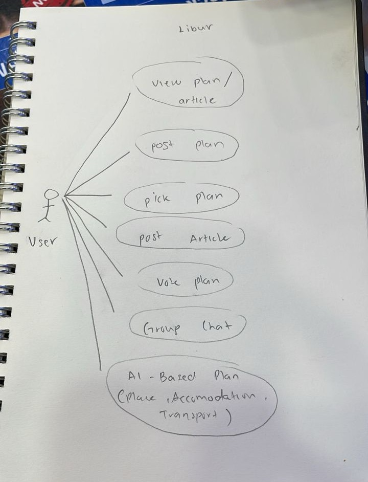
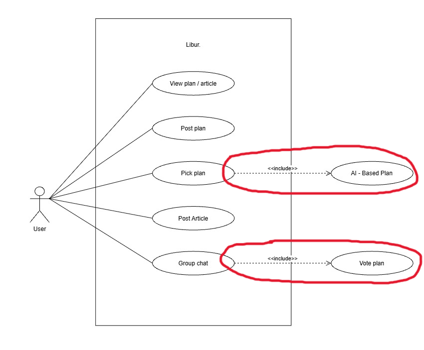
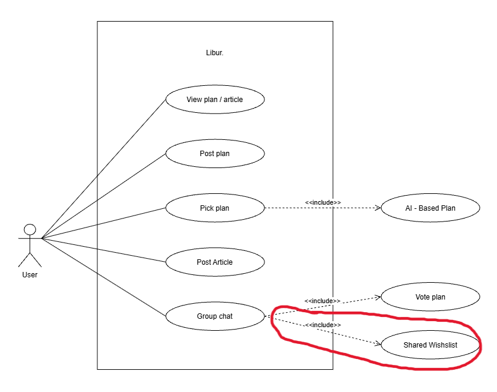
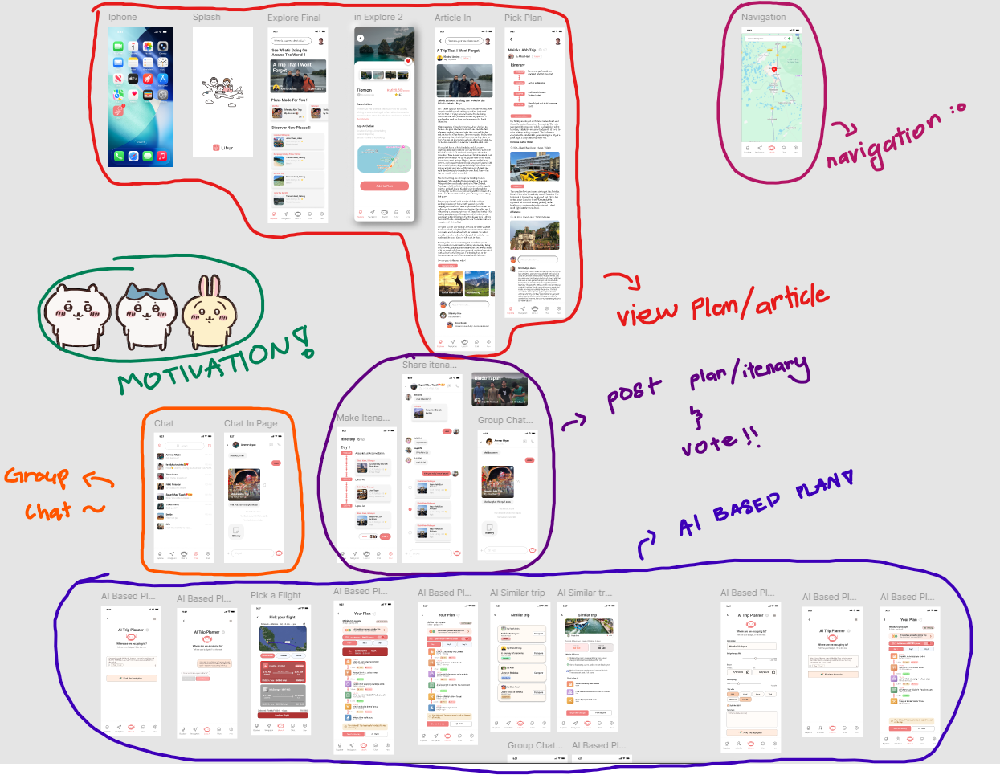

# Libur
### by **Myvi Putih Kebanggaan Tapah**

**Team:** 

- HARITH HAQEEMI BIN AHMAD
- AHMAD RUKAINIE BIN MOU YUSOP
- MUHAMMAD ARIF HILMI BIN REZUAN
- MUHAMMAD ZULHAZIQ BIN MOHD ISMAIL

**Problem Statement:** Planning an Escape

**Video Presentation:** [Libur - Myvi Putih Kebanggaan Tapah | CodeNection 2026]()

**Presentation Slides:** [Canva](https://canva.link/6m95gtzvh2kmhi3)

[Figma](https://www.figma.com/design/66g0aoE0PNANvZUSdOm1Ey/HACKATHON-MAIN?node-id=791-3000&t=pAjmVOn8bMZ3mvkE-0) · [Interactive Prototype](https://www.figma.com/proto/66g0aoE0PNANvZUSdOm1Ey/HACKATHON-MAIN?node-id=342-406&p=f&t=pAjmVOn8bMZ3mvkE-0&scaling=scale-down&content-scaling=fixed&starting-point-node-id=497%3A1343&show-proto-sidebar=1&page-id=0%3A1)

---

## 1. Project Overview

### The Problem

Group trips often fall apart during the planning stage because ideas, itineraries, and recommendations are scattered across different apps. On top of that, planning a trip from scratch can be time-consuming and tiring, so it often gets left to one “planner friend.”

**Stakeholders:**

- Groups of friends
- Families
- Frequent travellers
- Travel influencers and creators
- Travel journalists

**Existing alternatives fall short:**

-  **WhatsApp/Telegram** — hold the discussion but have no structured plan, voting, or itinerary output

- **Trip Planner AI** — Strong AI-powered itinerary generation, but it lacks community-shared travel plans and group chat features

- **Wanderlog** — Excellent for map-based collaboration and organizing bookings, but it  lacks an integrated community feed and group chat features

- **TripIt** — The gold standard for automatically organizing confirmed reservations into a timeline, but it is entirely reactive. It only helps you after you book; it offers zero help with discussion, democratic voting, or AI.

- **Lambus / Stippl** — Good all-in-one apps for group trips (especially for splitting expenses), but they still rely on the group manually building the itinerary. They lack Libur’s "Shared Wishlist" feature where AI automatically merges everyone's wants into a balanced master schedule.

### Our Solution
This sparked an idea: instead of making users plan everything from zero, why not let them discover, copy, and customize itineraries that have already been created and enjoyed by others?

**Libur** ("holiday" / "day off" in Malay & Indonesian) is a collaborative trip-planning app that combines AI-generated itineraries, community-shared travel plans and articles, and group decision-making — all in one place — so planning a trip with friends stops being a scattered mess spread across different apps, and everyone's wishes actually get fulfilled.

**Feature set:**
- **AI-Based Plan** — AI generates an itenaries with  places, accommodation, and transport.

- **Article + Plan duality** — users can post either inspirational travel articles *or* structured plans, browsed through the same unified feed, blending inspiration and execution.

- **Voting** — built into group chat, ensuring every voice is heard through transparent, democratic decision-making.

- **Shared Wishlist** — group members drop their individual must-dos into a shared wishlist, and the AI automatically weaves them into a balanced master itinerary.

---

## 2. Ideation & Process

### 2.1 Ideas We Considered

| Idea | Why it was kept / dropped |
|---|---|
| **Article + Plan duality** (Chosen) | Kept — lets anyone write about their travel experiences and share their itineraries, creating an active community where users can reply, share opinions, and engage with each other's trips. |
| **Voting** (Chosen) | Kept — voting only makes sense in the context of a group discussion to ensure fairness. |
| **AI-Based Plan** (Chosen) | Kept — AI is dominating the modern tech landscape, so integrating it felt like a natural step to stay relevant, keep up with industry standards, and avoid FOMO (Fear Of Missing Out). |
| **Shared Wishlist** (Chosen) | Kept — added to ensure every group member's choices and must-dos are clearly heard and seen by everyone. |
| **Hotel booking** (Considering)| Under consideration, not yet committed — Exploring direct booking so users can finalize the trip without leaving the app.  |
| **Navigation** (Considering) | Under consideration, not yet committed — added during the UI/UX pass once the team realized execution (not just planning) needed to live in the same app. |

### 2.2 Ideation Boards

The core feature set was mapped as a UML use-case diagram, evolved across three passes from hand-drawn drafts to a final digital version.

**Early hand-drawn draft**

*First pass at mapping use cases — Vote Plan and AI-Based Plan still stood alone.*

**Second draft**

*Vote Plan merged into Group Chat; AI-Based Plan merged into Pick Plan as an `<<include>>`.*
| Before | After | What changed & why |
|---|---|---|
| *Vote plan* listed as its own standalone use case | *Vote plan* included into **Group chat**  | Voting only makes sense in the context of a group discussion, so it was merged into the chat flow instead of being a separate, disconnected action. |
| *AI-Based Plan* listed as its own standalone use case | *AI-Based Plan* included into **Pick plan** | The team realized AI generation isn't a feature on its own — it's the mechanism *behind* plan selection, so the relationship was formalized as an include rather than a floating idea. |

**Latest draft**

*Shared Wishlist added as a second `<<include>>` off Group Chat.*

| Before | After | What changed & why |
|---|---|---|
| *Shared Wishlist* wasn't listed | *Shared Wishlist* is included into **Group chat**  | The idea came out of nowhere mid-build — not a planned pivot, just a spontaneous "what if everyone could drop their must-dos in and let the AI merge them" moment that got added as a second <<include>> off Group chat. |

*The finalized diagram used directly as the reference for building the UI/UX mockups.*

**Ideation board**

*Board translating the use-case diagram into screen flows and mockup direction.*

**Feature expansion consideration**

*Exploring Navigation and hotel booking as extensions to keep the full trip lifecycle — planning through execution — inside one app.*

### 2.3 Mentor Consultation

| Date | Mentor | Feedback Received | What Was Changed |
|---|---|---|---|
| [FILL IN] | [FILL IN] | [FILL IN] | [FILL IN] |

---

## 3. Design & Prototype

**UI Prototype:** [Interactive Prototype (Figma)](https://www.figma.com/proto/66g0aoE0PNANvZUSdOm1Ey/HACKATHON-MAIN?node-id=342-406&p=f&t=pAjmVOn8bMZ3mvkE-0&scaling=scale-down&content-scaling=fixed&starting-point-node-id=497%3A1343&show-proto-sidebar=1&page-id=0%3A1)

The final use-case diagram wasn't just documentation — it was used directly as the reference for building the UI/UX mockups and screen flow.

**AI-Based Plan**

*The AI generates a suggested plan (place, accommodation, transport) as part of picking a plan.*

**Article + Plan duality**
.png)
*A single feed and "View plan/article" entry point surfaces both inspirational articles and structured plans.*

**Voting**
.png)
*Voting happens inline within group chat, so decisions stay attached to the discussion that produced them.*

**Collaborative AI Group Plan**
.png)
*Group members add their must-dos to a shared wishlist, which the AI weaves into one master itinerary.*

---

## 4. What Makes It Different

- **Article + Plan duality** — instead of isolating inspiration from execution, Libur empowers everyone to write about their travels and share real itineraries, creating an active community where users can reply, share opinions, and adopt trips directly from the feed.

- **AI-Based Planning** — because AI is transforming the modern tech landscape, integrating it directly into the plan generation process is a natural step to stay relevant, avoid FOMO, and effortlessly do the heavy lifting for users.

- **In-Chat Voting** — democratic decision-making is built directly into the discussion thread, guaranteeing a fair, transparent planning process where everyone gets an equal vote and the group stays aligned.

- **Shared Wishlist → AI merge** — The app takes everyone's must-dos and automatically creates a schedule that works for the whole group.

---

## 5. Technical Architecture & Feasibility

### Tech Stack

| Layer | Choice | Why / Constraints |
|---|---|---|
| Frontend | Flutter (Mobile App) & Tailwind CSS (Web/Admin) | Flutter allows building natively compiled applications for both iOS and Android from a single codebase, which saves development time. Tailwind CSS is paired with Laravel to quickly style any web-based admin dashboards or landing pages. |
| Frontend | Swift (iOS) | Cannot afford a Macbook. |
| Backend | Laravel (PHP) | A robust, highly secure framework that makes building RESTful APIs to communicate with the Flutter app fast and efficient. It handles complex logic for group chats, voting, and AI prompts seamlessly. |
| Database | MySQL | A reliable relational database that perfectly handles the complex, structured relationships between users, group chats, shared wishlists, and travel itineraries. |
| APIs / Services | GeminiAI API & Google Maps API | GeminiAI is required to power the AI itinerary generation and merge the "Shared Wishlists." Google Maps (or Mapbox) is needed to handle the real-world location data and the in-app Navigation feature. | 
| Hosting | Railway | Provides effortless, automated deployment for the Laravel backend and database directly from GitHub. It removes the complex server configuration of traditional hosting (like AWS), making it ideal for rapid development and scaling. |
| Hosting | Vercel / Netlify (Dropped) | Built primarily for static sites, frontend frameworks (Next.js, React), and Node.js serverless functions. They do not natively support traditional long-running PHP/Laravel runtimes, persistent relational databases, or background queues without complex third-party adapters. |
| Hosting | Heroku / AWS (Dropped) | Heroku requires paid tiers for basic relational database add-ons and has higher ongoing costs. AWS (EC2/RDS) introduces heavy DevOps overhead, server maintenance, and complex configuration that slows down rapid iteration. |

### System Architecture Diagram

[FILL IN — optional]

### Build Plan & Scope

* **Android-First Deployment:** Due to hardware constraints (no MacBook for local Xcode compilation), the immediate build phase will exclusively target a functional Android APK using Flutter. iOS deployment is deferred until cloud CI/CD pipelines can be configured post-launch.

* **Core Community Feed:** Implementation of the "Article + Plan Duality" interface, featuring CRUD (Create, Read, Update, Delete) operations for users to post and browse both travel blogs and structured itineraries.

* **Group Chat & Shared Wishlist:** Development of the backend logic in Laravel and UI in Flutter to support group creation, basic messaging, and a shared data bucket where members can add their destination requests.

* **Gemini AI Integration:** Managed via server-side prompts in the Laravel backend, the Gemini API powers two core features: automatically building structured, day-by-day itineraries from scratch (AI-Based Plan), and processing the unstructured requests from the group's Shared Wishlist to seamlessly merge everyone's individual preferences into a single, balanced master schedule.

